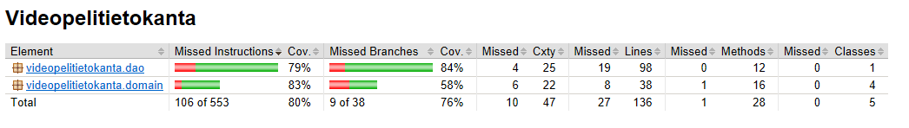

# Testausdokumentti

Ohjelmaa on testattu yksikkötestein, monia luokkia yhdistelevillä testeillä, sekä manuaalisesti. FileDao-luokkaa on testattu testitekstidokumentilla testfile, jonka testit luovat, kun ne ajetaan. Jokaisen testin jälkeen testfile:stä poistetaan kaikki pelit. Suuri osa testeistä testaa VideoGame ja FileDao luokkien yhteyksiä, mutta yksikkötestejäkin on.

### Testikattavuus
Rivikattavuus on 80% ja haarautumakattavuus

### Testauksen puutteet 
Testikattavuuden ulkopuolella olevat osat ovat paljolti tiedostojen lukemisessa liittyviä try-catchien catch osioita. Ne ovat virheilmoituksia, johon ohjelma ei päädy. Toki muitakin aukkoja testauksessa on, kattavuus ei ole täydellinen vaikka onkin korkea.

### Manuaalinen testaus
Ohjelmaa on ajettu tilanteissa, missä tiedostot games ja testfile puuttuvat, tai ne ovat jo luotu. Kummassakin tilanteessa ohjelma toimii hyvin. Teksti käyttöliittymää ei ole testattu automaattisesti.

### Puutteita
Mikäli testfile:ä tai games:ia käydään muuttamassa ilman ohjelmaa, niin ohjelma sekoilee ja kaatuilee, eikä osaa sanoa mitään järkevää käyttäjälle.

