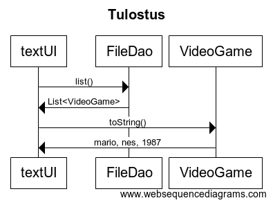

## Pakkausrakenne:

Pakkausrakenne on kuvattu alla. AlphabeticComparator luokan lisäksi domain pakkaus sisältää kaksi muuta yksinkertaista Comparator luokkaa, joita FileDao käyttää videopelien järjestämiseen. 

## Sekvenssikaavio tulostuksesta

## Tietojen pysyväisväistallennus

Dao rajapinnan toteuttava FileDao luokka hoitaa tietojen tallennuksen juuressa olevaan ennalta määrättyyn games.txt tiedostoon. Ennalta määrätyn tekstitiedoston muuttaminen kovakoodatusta käyttäjän määriteltäväksi olisi helpohkoa toteuttaa tämänhetkiseen FileDao-luokkaan.

Pelit tallennetaan tiedostoon alla olevassa muodossa. Viimeisenä oleva boolean merkitsee, onko peli pelattu läpi.

<pre>
Super Mario Bros./Duck Hunt;nes;1987;true
Metroid;nes;1988;false
</pre>

Pelit eivät saa sisältää puolipisteitä. Lisäksi kaksi peliä samaistetaan, jos niillä on sama nimi. (Nimet muutetaan pieniksi kirjaimiksi ja verataan sitten merkkijonoina). Toisin sanoen samannimisiä pelejä ei voi tallentaa tietokantaan useita.

Toisaalta FileDao:n voisi korvata tietokantaan perustuvalla tallennusjärjestelyllä. Tällöin pitäisi luoda uusi luokka esim SQLDao, joka totetuttaisi Dao rajapinnan.

## Käyttöliittymä

Mainapplication ei tee muuta, kuin käynnistää TextUi:n käyttöliittymän. Tekstikäyttöliittymä voitaisiin korvata graafisella käyttöliittymällä.

